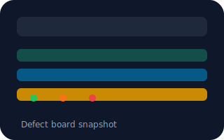
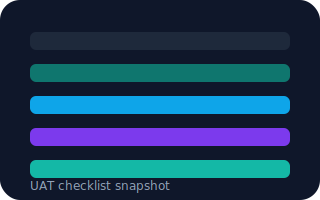
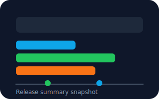

# CycleReady QA Release Room

This repo now ships a Phase 8 "Release Room" microsite that bundles the live app, release summary, QA artifacts (UAT packet, test evidence, defect board), and the final QA recommendation into a single GitHub Pages experience.

## Running locally
1. Install dependencies: `npm install`.
2. `npm run dev` and visit `http://localhost:5173/` for the main experience.
3. Open `http://localhost:5173/release-room.html` to preview the release room and `http://localhost:5173/release-summary.html` for the dedicated summary page.
4. Build with `npm run build` to generate `dist/` (includes both release-room and release-summary bundles).

## Release artifacts
- **UAT packet PDF** is generated from `docs/uat-plan.md` with `npm run docs:pdf` and published under `public/assets/cycleready-uat-packet.pdf`.
- **Test evidence** links live documentation plus the Playwright smoke report (`playwright-report/index.html`).
- **PDF requirement**: `npm run docs:pdf` relies on `weasyprint` being installed (e.g., `python3 -m pip install --user weasyprint`), the script surface finds the user `bin` directory automatically via `python3 -c 'import site, os; print(os.path.join(site.USER_BASE, "bin"))'`.

## Portfolio card

Simulated end-to-end QA ownership for a recertification workflow, from story review and design review through UAT, defect triage, smoke automation, and release recommendation.

Resume bullet:
> Led a QA release-readiness simulation for a CME/recertification workflow, including acceptance-criteria review, UAT design, defect triage, smoke automation with Playwright, and final release reporting.

## GitHub Pages deployment
A workflow in `.github/workflows/pages.yml` now publishes `dist/` to the `gh-pages` branch on every push or PR to `master`. The microsite is available at `https://josuejero.github.io/CycleReady/release-room` and the standalone release summary at `https://josuejero.github.io/CycleReady/release-summary.html`.

## Testing
- `npm run build` (produces `dist/` with the release-room and release-summary entries).
- `npm run test:e2e` (Playwright smoke suite, results appear under `playwright-report/`).
