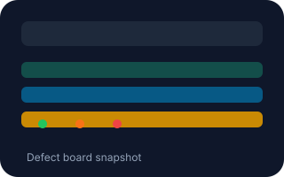
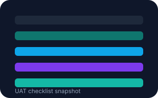
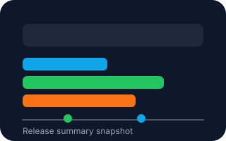

# CycleReady QA Release Room

CycleReady is a QA release-readiness demo for a CME recertification workflow. It shows clinician submissions, reviewer actions, reminders, defect tracking, UAT artifacts, Playwright smoke/regression checks, and release signoff evidence in a static React/TypeScript app. This project demonstrates QA analysis, test design, acceptance criteria, defect triage, release reporting, Playwright automation, and GitHub Pages deployment.

## Quick links
- **Live demo:** [dashboard](https://josuejero.github.io/CycleReady/), [Release Room](https://josuejero.github.io/CycleReady/release-room.html), [Release Summary](https://josuejero.github.io/CycleReady/release-summary.html)
- **Screenshots:** [defect board](public/assets/portfolio/defect-board.svg), [UAT checklist](public/assets/portfolio/uat-checklist.svg), [release summary](public/assets/portfolio/release-summary.svg)
- **Test report:** `docs/playwright-smoke.md`, `playwright-report/index.html` after `npm run test:e2e`, generated metrics in `reports/latest/`
- **CI workflow:** `.github/workflows/playwright-smoke.yml`, `.github/workflows/pages.yml`
- **Architecture docs:** `docs/test-strategy.md`, `docs/requirements-traceability-matrix.md`, `docs/uat-plan.md`
- **Main code to inspect:** `src/components/ReleaseRoomPage.tsx`, `src/data/release-room.ts`, `tests/`, `docs/`

## Employer scan
**Best fit roles:** QA Automation Engineer, QA Analyst, Software Test Engineer, Release Coordinator  
**Core stack:** React, TypeScript, Vite, Tailwind CSS, Playwright, GitHub Actions, GitHub Pages  
**What this proves:** Acceptance criteria, UAT planning, defect triage, smoke/regression automation, release reporting, static deployment  
**Start here:** `src/components/`, `src/data/release-room.ts`, `docs/`, `.github/workflows/`

## QA evidence snapshot
<!-- METRICS:START -->

| Metric | Value |
|---|---:|
| Requirements documented | 15 |
| Requirements covered | 15 / 15 |
| Requirement coverage rate | 100% |
| Manual test cases | 25 |
| Automated Playwright tests | 27 |
| Automated pass rate | 100% |
| Open Sev1 defects | 1 |
| Open Sev2 defects | 2 |
| Latest release decision | No-go |
| Last generated | 2026-05-02T20:54:00.976Z |

<!-- METRICS:END -->

| Area | Current evidence |
|---|---|
| Workflow surfaces modeled | Dashboard, Log CME, History, Reminders, Upload Support, Reviewer Actions, Release Room, Release Summary |
| Requirements traceability | `docs/qa/rtm.csv` |
| Manual test design | `docs/qa/test-cases.csv` |
| Defect triage | `docs/qa/defect-log.csv` |
| Release gates | `docs/qa/release-gates.csv`, `reports/latest/release-decision.json` |
| Evidence artifacts | Playwright report, QA metrics JSON, unit coverage, Lighthouse report, UAT packet |

## How to review this project
1. Open the live demo.
2. Open the Release Room.
3. Review `docs/qa/rtm.csv` for requirements traceability.
4. Review `docs/qa/test-cases.csv` for manual test design.
5. Review `docs/qa/defect-log.csv` for blocker triage.
6. Run `npm run evidence` to regenerate build, Playwright, and metrics evidence.
7. Review GitHub Actions artifacts from the latest QA Evidence workflow run.

## Screenshot gallery

## Table of contents
- [Quick links](#quick-links)
- [Employer scan](#employer-scan)
- [QA evidence snapshot](#qa-evidence-snapshot)
- [How to review this project](#how-to-review-this-project)
- [Screenshot gallery](#screenshot-gallery)
- [What it demonstrates](#what-it-demonstrates)
- [Release narrative](#release-narrative)
- [Data & UX](#data--ux)
- [Tech stack & automation](#tech-stack--automation)
- [Getting started](#getting-started)
- [Release artifacts](#release-artifacts)
- [Testing](#testing)
- [Deployment](#deployment)
- [Résumé-ready takeaway](#résumé-ready-takeaway)

## What it demonstrates
- **Clinician QA dashboard**: seeded CME activities stored in `src/data/seed.json` feed `src/App.tsx`, showing credits logged, completion %, reviewer statuses, key dates, and timeline widgets.
- **Reviewer workflow controls**: `LogForm`, `UploadSimulator`, `ReviewerPanel`, and `RemindersPanel` keep the dashboard in sync while the reviewer can request corrections, change status, or mark uploads complete.
- **History & reminders**: `HistoryList` highlights the clinician’s timeline, and `RemindersPanel` surfaces missing metadata or correction requests tied to each activity.
- **Release-room microsite**: `src/components/ReleaseRoomPage.tsx` aggregates readiness metrics, defect board, evidence links, and the QA signoff memo for an executive snapshot, while `ReleaseSummaryPanel` powers the accompanying summary entrypoint (`release-summary.html`).
- **Static proof of release readiness**: no backend is required—React + Vite renders the experience using LocalStorage to persist clinician activities between sessions.

## Release narrative
1. **Dashboard (root `/`)** mirrors a clinician logbook with seeded entries plus timeline history, making it easy to step through QA scenarios (approved activities, pending reviews, requested corrections).
2. **Release Room (`release-room.html`)** surfaces QA readiness by combining the story coverage percentage, Playwright smoke suite summary, open defect board (`src/data/release-room.ts`), and linked evidence (UAT plans, results, triage guidelines).
3. **Release Summary (`release-summary.html`)** distills the recommendation, blocker owners, and final QA memo so stakeholders get a fast go/no-go brief.

## Data & UX
- **Seeded content**: `src/data/seed.json` contains clinician activity logs, key NCCPA dates, and defect summary metadata that feeds `seedActivities`, `keyDates`, and `defectSummary` across the app.
- **Activity lifecycle**: adding or editing an entry updates `LocalStorage` via `persistActivities`, ensuring status counts, reminders, and reviewer notes stay consistent for credit tracking.
- **Timeline storytelling**: Each activity’s timeline entries (`activity.timeline`) capture clinician submissions and reviewer actions so QA reviewers can replay conversations.

## Tech stack & automation
- **UI layer**: Vite + React + TypeScript + Tailwind CSS keeps the microsite bundle light whilst providing responsive layouts and gradient styling.
- **Data modeling**: Type definitions in `src/data/types.ts` (used by components and helpers) keep CME logs, reviews, and release metadata strongly typed.
- **Automation & docs**: Playwright (`npm run test:e2e`) powers smoke and regression checks, `npm run metrics` generates JSON evidence under `reports/latest/`, and `npm run docs:pdf` uses Pandoc + WeasyPrint to re-export `docs/uat-plan.md` as a PDF proof (`public/assets/cycleready-uat-packet.pdf`).

## Getting started
1. `npm install`
2. `npm run dev` → visit `http://localhost:5173/CycleReady/` for the dashboard, open `http://localhost:5173/CycleReady/release-room.html` for the Release Room, and `http://localhost:5173/CycleReady/release-summary.html` for the executive summary experience.
3. `npm run build` produces the static `dist/` bundle that includes both `release-room` and `release-summary` entrypoints (ready for GitHub Pages).

## Release artifacts
- **UAT packet**: `npm run docs:pdf` converts `docs/uat-plan.md` to `public/assets/cycleready-uat-packet.pdf`; requires WeasyPrint (`python3 -m pip install --user weasyprint`). The script prepends the user’s `bin` directory via `python3 -c 'import site, os; print(os.path.join(site.USER_BASE, "bin"))'` so the binary is discoverable.
- **Test evidence**: `Playwright smoke report` lives in `playwright-report/index.html`, generated metrics live in `reports/latest/`, while UAT logs and triage guidelines link back to `docs/uat-results.md` and `docs/triage-guidelines.md`.
- **Defect tracking**: `src/data/release-room.ts` defines open issues (IDs CR-401, CR-312, CR-287) complete with severity, owner, status, and triage steps, which power the Release Room board.

## Testing
- `npm run qa:validate` checks QA CSV references and Playwright automation IDs.
- `npm run test:e2e` runs the Playwright smoke and regression suite and writes artifacts to `playwright-report/` for reference.
- `npm run coverage` runs unit coverage for pure readiness helpers and writes local artifacts to `reports/coverage/`.
- `npm run audit:lighthouse` runs Lighthouse CI against the built static entrypoints.
- `npm run evidence` regenerates build, Playwright JSON, and QA metrics evidence.
- `npm run build` ensures both entrypoints bundle correctly for static hosting.

## Deployment
- GitHub Pages workflow (`.github/workflows/pages.yml`) publishes `dist/` from `master`, making the Release Room available at `https://josuejero.github.io/CycleReady/release-room.html` and the summary at `https://josuejero.github.io/CycleReady/release-summary.html`.
- `npm run docs:pdf` must be rerun whenever `docs/uat-plan.md` changes to keep the published PDF in sync.
